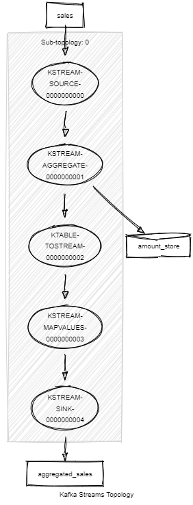
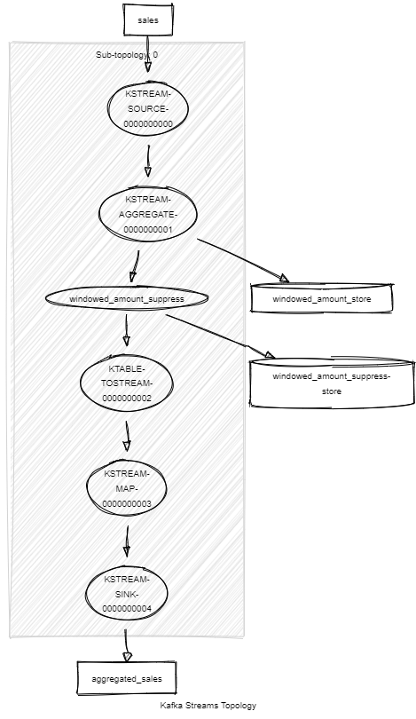

# Kafka Streams PoC example

A simple application written in Java using Spring and Kafka Stream to aggregate the data of a topic

## What it does

The application listens to an kafka topic ```orders``` containing very simple order data that contains the id of the order, the 
customer id, the cost, the item id and the item amount. The key of the kafka message is the `orderId`.

```json
{
  "orderId": "ORDER01",
  "customerId": "CUST01",
  "itemId": "ITEM01",
  "itemAmount": 1,
  "cost": 200
}
```

This messages are then aggregated before being sent back to 2 other kafka topics (```aggregated_invoices``` and 
```aggregated_shipment_items```). You can control the size of the
aggregation window by setting the `app.window.duration` parameter to any value (5m for 5 minutes for example) or
set it to 0 if you don't want to aggregate the sale just in a timed window.

If set to 0 the updated aggregated value for a given shop will be sent to the topic at a regular interval.

```json
{
  "itemId": "ITEM01",
  "itemAmount": 3
}
```

If a size if configured for the window then the aggregated value for a given shop will be sent once when the window
gets closed. The output message will also contain the start and end date/time of the window.

```json
{
  "shopId": "SHOP01",
  "amount": 71.4,
  "periodStart": "2019-04-04T17:21:35",
  "periodEnd": "2019-04-04T17:21:40"
}
```

> See [this link][0] for more information on how to just output the final value of the windowed aggregation.

## Topologies

### Without window



### With window



## Run application

```sh
# Run app
./mvnw spring-boot:run

# Run tests (note the clean to ensure the state store is cleaned up)
./mvnw clean test
```

You will also need a running Kafka instance. If you have docker installed this project has a
docker-compose file that starts a zookeeper, a kafka broker and kafkahq which is a nice ui
that ease the interaction with the kafka broker and that you can access at localhost:8090.

```sh
docker-compose up -d
```

[0]: https://docs.confluent.io/current/streams/developer-guide/dsl-api.html#window-final-results
